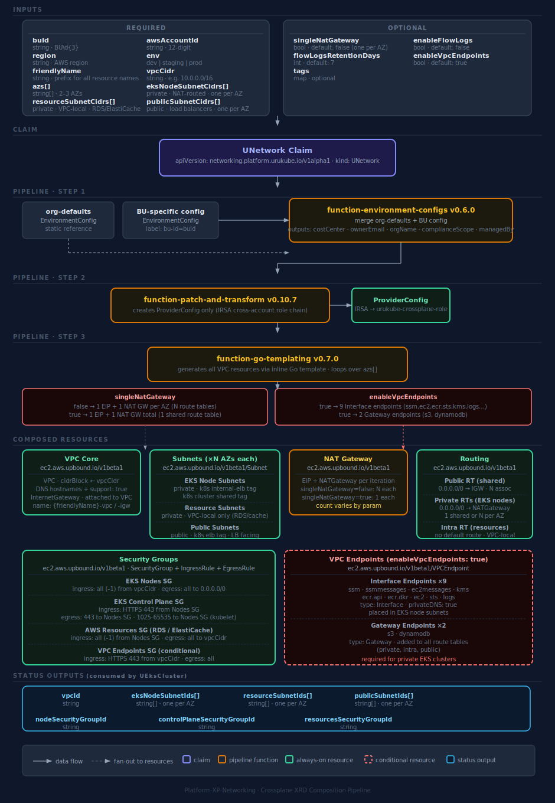

# platform-xp-networking

Crossplane XRD package that provides a self-service VPC networking golden path for the `urukube` platform. ArgoCD auto-discovers this repo via the `platform-custom-xrds` GitHub topic and deploys it to `crossplane-system` on the orchestrator cluster.

## Composition pipeline



## What gets provisioned

Every `UNetwork` claim creates the following AWS resources in the target account:

| Resource | Configurable |
|---|---|
| VPC | CIDR, region, account |
| Internet Gateway | No — always created |
| EKS node subnets (private, NAT GW route) | One per AZ — CIDRs required |
| Resource subnets (private, VPC-local only) | One per AZ — CIDRs required |
| Public subnets (for load balancers) | One per AZ — CIDRs required |
| EIP + NAT Gateway | Yes — single or one per AZ (`singleNatGateway`) |
| Route tables + routes + associations | No — created automatically per tier |
| Security group: EKS nodes | No — always created |
| Security group: EKS control plane | No — always created |
| Security group: AWS resources (RDS, ElastiCache) | No — always created |
| Security group: VPC endpoints | Yes — conditional on `enableVpcEndpoints` |
| Interface VPC endpoints (SSM, ECR, KMS, STS, EC2, logs…) | Yes — `enableVpcEndpoints` (default: `true`) |
| Gateway VPC endpoints (S3, DynamoDB) | Yes — `enableVpcEndpoints` (default: `true`) |
| VPC flow logs | Yes — `enableFlowLogs` (default: `false`) |

## Parameters

| Field | Required | Default | Description |
|---|---|---|---|
| `spec.parameters.awsAccountId` | Yes | — | 12-digit AWS account ID |
| `spec.parameters.region` | Yes | — | AWS region (e.g. `us-east-1`) |
| `spec.parameters.buId` | Yes | — | Business Unit ID (e.g. `BU001`) |
| `spec.parameters.env` | Yes | — | Environment: `dev`, `staging`, or `prod` |
| `spec.parameters.friendlyName` | Yes | — | Short name prefix used in resource naming (e.g. `bu001-dev`) |
| `spec.parameters.vpcCidr` | Yes | — | VPC CIDR block (e.g. `10.0.0.0/16`) |
| `spec.parameters.azs` | Yes | — | Availability zones — 2 or 3 (e.g. `[us-east-1a, us-east-1b, us-east-1c]`) |
| `spec.parameters.eksNodeSubnetCidrs` | Yes | — | Private subnet CIDRs for EKS nodes, one per AZ |
| `spec.parameters.resourceSubnetCidrs` | Yes | — | Private subnet CIDRs for AWS resources, one per AZ |
| `spec.parameters.publicSubnetCidrs` | Yes | — | Public subnet CIDRs for load balancers, one per AZ |
| `spec.parameters.singleNatGateway` | No | `false` | Use one shared NAT GW instead of one per AZ. Saves cost — recommended for dev only |
| `spec.parameters.enableVpcEndpoints` | No | `true` | Create VPC endpoints for SSM, ECR, KMS, STS, S3, and more |
| `spec.parameters.enableFlowLogs` | No | `false` | Enable VPC flow logs to CloudWatch Logs |
| `spec.parameters.flowLogsRetentionDays` | No | `7` | Flow log retention period in days |
| `spec.parameters.tags` | No | — | Additional tags as key-value pairs |

### Default subnet CIDRs for a `10.0.0.0/16` VPC with 3 AZs

| Tier | AZ a | AZ b | AZ c |
|---|---|---|---|
| EKS nodes (private) | `10.0.0.0/19` | `10.0.32.0/19` | `10.0.64.0/19` |
| Resources (private) | `10.0.96.0/19` | `10.0.128.0/19` | `10.0.160.0/19` |
| Public | `10.0.192.0/24` | `10.0.193.0/24` | `10.0.194.0/24` |

## Example claims

Production (3 AZs, one NAT GW per AZ, VPC endpoints on):
```yaml
apiVersion: networking.platform.urukube.io/v1alpha1
kind: UNetwork
metadata:
  name: bu001-prod-network
  namespace: bu001
spec:
  parameters:
    buId: BU001
    awsAccountId: "222222222222"
    region: us-east-1
    env: prod
    friendlyName: bu001-prod
    vpcCidr: 10.0.0.0/16
    azs:
      - us-east-1a
      - us-east-1b
      - us-east-1c
    eksNodeSubnetCidrs:
      - 10.0.0.0/19
      - 10.0.32.0/19
      - 10.0.64.0/19
    resourceSubnetCidrs:
      - 10.0.96.0/19
      - 10.0.128.0/19
      - 10.0.160.0/19
    publicSubnetCidrs:
      - 10.0.192.0/24
      - 10.0.193.0/24
      - 10.0.194.0/24
```

Dev (2 AZs, single NAT GW to reduce cost):
```yaml
apiVersion: networking.platform.urukube.io/v1alpha1
kind: UNetwork
metadata:
  name: bu001-dev-network
  namespace: bu001
spec:
  parameters:
    buId: BU001
    awsAccountId: "111111111111"
    region: us-east-1
    env: dev
    friendlyName: bu001-dev
    vpcCidr: 10.1.0.0/16
    azs:
      - us-east-1a
      - us-east-1b
    eksNodeSubnetCidrs:
      - 10.1.0.0/19
      - 10.1.32.0/19
    resourceSubnetCidrs:
      - 10.1.96.0/19
      - 10.1.128.0/19
    publicSubnetCidrs:
      - 10.1.192.0/24
      - 10.1.193.0/24
    singleNatGateway: true
```

## Consuming the outputs (hand-off to UEks)

Once the claim is `Ready`, read the status fields and pass them as parameters to your `UEks` claim:

```bash
kubectl get unetwork bu001-prod-network -n bu001 -o yaml | grep -A 20 'status:'
```

Key status fields:

| Field | Use in UEks claim |
|---|---|
| `status.vpcId` | `spec.parameters.vpcId` |
| `status.eksNodeSubnetIds` | `spec.parameters.subnetIds` |
| `status.nodeSecurityGroupId` | `spec.parameters.nodeSecurityGroupId` |
| `status.controlPlaneSecurityGroupId` | `spec.parameters.controlPlaneSecurityGroupId` |

## Cross-account setup

The composition dynamically creates an `aws.upbound.io/v1beta1 ProviderConfig` per claim that chains the orchestrator's IRSA role into the target account:

```
Orchestrator IRSA role → sts:AssumeRole → arn:aws:iam::<awsAccountId>:role/urukube-crossplane-role
```

Each target AWS account must have a role named `urukube-crossplane-role` with:

1. **Trust policy** — allows the orchestrator's Crossplane IRSA role to assume it:

```json
{
  "Effect": "Allow",
  "Principal": {
    "AWS": "arn:aws:iam::<orchestrator-account-id>:role/<crossplane-irsa-role-name>"
  },
  "Action": "sts:AssumeRole"
}
```

2. **Permissions** — EC2 permissions required to manage VPC resources:

```json
{
  "Effect": "Allow",
  "Action": "ec2:*",
  "Resource": "*"
}
```

## Files

| File | Purpose |
|---|---|
| `provider.yaml` | Installs `upbound-provider-aws-ec2:v1.21.0`; references the `provider-aws-irsa` DeploymentRuntimeConfig |
| `xrd.yaml` | Defines the `XUNetwork` / `UNetwork` API and parameter schema |
| `composition.yaml` | Maps a claim to all VPC resources and publishes subnet/SG IDs to status |
| `functions.yaml` | Pins the three Crossplane functions used in the composition pipeline |
